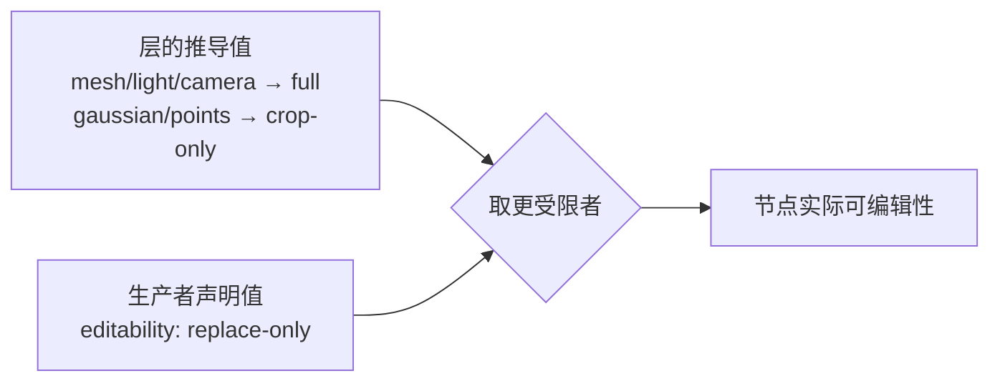
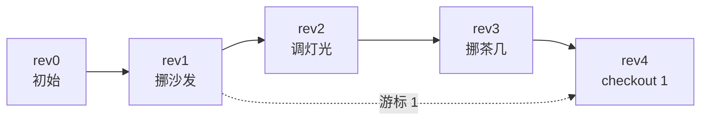

# 内核契约（`crates/core`）

> 状态：✅ **已实现**（2026-09-19）· 测试：6 单测 + 23 不变量 + 1 doctest · 冒烟：`scripts/smoke.sh` §6（22 项）
>
> 这份文档是**给未来的自己看的**：`io` / `render` / `eval` / `agent` 与平台侧都要站在这里写好的契约上，
> 所以「什么不许变、变了会怎样」必须写清楚，而不是靠读代码猜。

---

## 1. 定位与边界

内核是引擎的**唯一真相来源**：Agent 的每次改动都是一条命令，命令进日志，日志能重放出状态。

**它不含**：渲染、文件 IO、网络、LLM。
**它必须能**：同时编译到 `wasm32`（内嵌壳）与 native（命令行 / MCP 壳），依赖只有 `serde` / `serde_json` / `sha2`。

这条边界不是为了洁癖——它是「内核能被单测穷尽」与「同一个内核跑在两个壳里不会漂移」的前提。
两条约束写死在工程里：**内核不依赖宿主；内核不许 import 渲染。**

---

## 2. 四条不变量

不变量必须对**调用方可见的行为**成立，所以 `tests/invariants.rs` 只用公开 API 写，
而且刻意用 H0 的真实剧本（同一份客厅）当夹具。

| # | 不变量 | 含义 | 为什么重要 | 对应测试 |
| --- | --- | --- | --- | --- |
| I1 | **可逆** | `apply(cmd)` 后 `apply(inverse)` 回到**逐字段相同**的状态 | RSI 要能回到 best-so-far | `apply_then_inverse_restores_exact_state` · `rotation_inverse_is_exact_even_though_aabb_rotation_is_lossy` |
| I2 | **可重放** | `replay()` 与实时状态逐字段相同；快照与重放结果一致 | 分数曲线的每一步都要能归因 | `replay_equals_live_state` · `snapshots_agree_with_replay` · `checkout_jumps_and_stays_replayable` |
| I3 | **确定** | `scene_hash()` 稳定；日志哈希**不含墙钟** | 日志要进平台账本，同轨迹必须同哈希 | `scene_hash_is_content_addressed` · `log_hash_is_reproducible_across_runs` · `log_never_contains_wall_clock` |
| I4 | **游标一致** | `state_at(cursor()) == scene()` | `undo`/`redo` 的前提（见 §5.2） | `undo_chain_walks_back_to_the_start_and_then_refuses` · `long_mixed_history_stays_consistent` |

### 怎么让 I2 由构造保证

只有**一个**状态变换函数，实时执行与重放共用它：

```rust
pub fn apply_to_scene(scene: &mut Scene, cmd: &Command) -> Result<()>
```

如果这里有第二份实现（例如重放走一条"快速路径"），两份迟早会漂移，而漂移的表现是
"分数曲线看起来没问题，但回滚后的状态跟当时不一样"——这种 bug 极难查。
所以宁可让重放慢一点。

压力验证：`long_mixed_history_stays_consistent` 用确定性 LCG 跑 120 步（编辑 / 撤销 / 回滚混排），
**每一步之后**都断言重放与游标不变量。

---

## 3. 统一场景表示（USC）

三个硬约束（`scene.rs` 顶部注释里也写着）：

1. **与 glTF 2.0 同构**：`node` ↔ glTF node，「层」↔ `mesh.primitive`；
   3DGS 层用 Khronos 已 Ratified 的 `KHR_gaussian_splatting` 语义。我们自己的字段（`provenance` / `layers` / `metrics`）落盘进 glTF 的 `extras`。
2. **JSON 键沿用已发布的模板契约**（`objects` / `window` / `spanX` / `bandDepth` …）。
   `agent-app` 与 `harness-plugin` 两个脚手架模板里的 mock 引擎与评测插件**已经在读它们**——改键名等于破坏已分发的产物。
3. **开放 schema**：数值/枚举字段尽量用 `String` + 类型化访问器（`Node::role_kind()`），未知键进 `extras`。
   导入别人的场景不该因为多一个键就解析失败。

### 3.1 几何代理

H0 没有真实几何（那是 `io` 层的事），所以节点的 `aabb` **就是它的世界包围盒**。
接入真实几何后节点会变成 glTF 语义的 `transform + local geometry`，届时需要一次迁移——
这是**已知的、计划内的**破坏性变更，已在 `scene.rs` 里标注。

`Aabb::gap()` 的语义必须与 `scaffolds/*/files/src/*.mjs` 里的同名算法**逐字一致**，
否则插件算出来的分和内核报的告警会互相矛盾。

### 3.2 可编辑性（D6）



- 为什么两处来源：烘焙在世界坐标里训练出来的高斯，**能整体替换但不能单独移动**——这件事只有生产者知道，推导不出来。
- 为什么取 `max`（更受限）：任一来源都不能把门槛偷偷放宽。
- `ReplaceOnly` 的节点：`transform` 被拒（`not_editable`），但 `set_material` 仍允许（不需要动几何）。

### 3.3 id 是 stable_id

`obj:sofa_01` 在多次 `edit` 之后必须仍然指向同一把沙发——这是 diff、归因、回滚的共同前提。
裸名会自动补 `obj:` 前缀（`normalize_node_id`），并且名字**不由几何推导**（重命名不在 H0 范围内）。

---

## 4. 命令与逆命令

| op | 参数 | 可逆 | 破坏性 |
| --- | --- | --- | --- |
| `transform` | `translate` / `rotate_y_deg` / `scale` | ✓ | |
| `set_light` | `intensity` / `color` | ✓ | |
| `set_material` | `material` / `roughness` / `metallic` / `opacity` | ✓ | |
| `remove` | — | ✓（`restore.node`） | ✓ 会先打快照 |
| `checkout` | `rev` | ✓（回到当前版） | |

### 4.1 逆命令是「恢复原值」，不是「参数取反」

AABB 旋转在代数上**不可逆**（转 30° 再转 −30° 得到的是更大的盒子，不是原盒子）。
所以逆命令一律由内核在**执行前**从前置状态算出（`Document::compute_inverse`），
形态是 `Restore::{Bounds,Light,Material,Node}`——记录**绝对原值**。

推论：`Restore` **不接受外部直接发送**（`CommandRequest::parse` 会拒绝），
外部只能发语义命令，逆命令是内核的职责。这样 Agent 也没法伪造一个假逆命令去污染日志。

### 4.2 空操作直接拒绝

两种空操作都会被 `no_op` 拒绝，且**不产生版本**：
参数全默认（`is_noop_shape`）、以及执行后场景逐字段没变（设成同一个值）。
理由：Agent 循环里空操作是纯粹的浪费，还会把日志灌满噪声。

### 4.3 失败即原子

任何一步失败（未知目标 / 参数越界 / NaN / 不可编辑）都必须让
`revision`、`scene`、`scene_hash` **完全不变**（`failed_command_leaves_state_untouched`）。
否则 Agent 会基于一个"改了一半"的世界做判断。

---

## 5. 日志 / 游标 / 快照

### 5.1 日志是 append-only

撤销、重做、回滚**本身也是命令**，也进日志。好处：轨迹可审计、可重放，
「谁在第几步因为什么改了什么」永远查得到。

### 5.2 游标（D5）——这是实现时踩出来的坑

最直觉的做法是 `undo()` = 「把最后一条日志反过来」。**它是错的**：

> 因为撤销本身也进日志，「当前状态 == 最后一条日志的后置状态」这个假设
> 在 `checkout` 之后就不成立了。结果是撤销越过正向历史后会在几个状态之间**来回振荡**，
> 而不是继续往回走。（这个 bug 是被 `undo_chain_...` 这条不变量测试逼出来的。）

修正后引入两个概念：

| 概念 | 定义 | 判定 |
| --- | --- | --- |
| **游标 `cursor`** | 当前场景等于哪一版的状态 | 看日志尾巴：最后一条是 `checkout{t}` 则 `cursor = t`，否则 `cursor = 最新 rev` |
| **历史前沿 `head`** | 线性历史里最远那一版 | `max(每条真实编辑的 rev, 每个 checkout 的目标)` |

- `undo()` = 回到 `cursor - 1`；`cursor == 0` 时返回 `nothing_to_undo`（而不是偷偷开始重做）。
- `redo()` = 推进到 `cursor + 1`，**上界是 `head` 而不是 `revision`**——否则会掉进自己的撤销条目里振荡。
- 两者都是**推导值**，不单独存：真相仍然只在 `oplog` 里。



上面这张图里：`revision = 4`、`cursor = 1`、`head = 3`。
`undo()` 会回到 rev 0；`redo()` 会推进到 rev 2（顺着 §5 的线性历史），而**不是**去 rev 5。

### 5.3 快照只是优化，不是真相

快照点是：rev 0、每次破坏性命令**之前**、每次 checkout 的落点。
落盘时**不写快照**（可从日志重算），加载后由 `snapshot == state_at` 不变量兜底。
`scene verify` 会把每个快照点与重放结果逐字段比一遍。

### 5.4 落盘与自检

文档 = `spec + revision + initial + scene + oplog`。加载时会强制校验：

- 日志连续（第 i 条的 `rev` 必须是 `i+1`）、`revision == oplog.len()`
- **`state_at(revision) == scene`** —— 日志是唯一真相，那么重放结果必须等于存下来的状态。
  不一致就拒绝加载：宁可报错，也不要拿一份假状态往下跑。

`log_hash` 会把 `at_ms` 剥掉再哈希（当前实现根本不写墙钟）。
原因：日志要进平台账本，账本的可比性依赖「同一条轨迹同哈希」，带上时间戳就永远对不上。

---

## 6. 告警（`validate`）

输出**已排序去重**（`Warning` 实现了 `Ord`/`Hash`），所以同状态的告警顺序永远一致——可比较。

| code | 判定 | 涉及节点 |
| --- | --- | --- |
| `bounds.out_of_room` | 非 floor 角色的节点不被房间包围盒包含 | 1 |
| `bounds.floating` | 家具离地 > 0.02m | 1 |
| `layout.intersect` | 两个 solid 角色的 AABB 相交/相贴 | 2 |
| `rule.dangling` | 间距规则引用了不存在的节点 | 2 |
| `rule.violated` | 实测间距到合法区间的距离 > 0 | 2 |
| `window.blocked` | solid 节点落在窗前挡光带且与窗有 x/y 重叠 | 1 |
| `light.out_of_range` | 灯光强度不在 0–5 | 1 |
| `intent.missing` | 某个意图关键词标了 `present: false` | 0 |

**「新告警」按身份判（code + 涉及节点），不看全文。**
否则同一处问题只因数值变了（间距 3.9m → 2.6m）就会每轮都报一次，把 Agent 的上下文刷满。
数值细节在 `warnings()` 里随时拿得到。

> `light.out_of_range` 的 0–5 与「家具悬空 0.02m」是**家居场景的经验阈值**，写在常量里。
> 换场景要连同阈值一起换——这是 `scaffold` 模板该承载的东西。

---

## 7. 归因

每条命令都能携带 Agent 的判断：

```json
{ "op": "transform", "target": "sofa_01",
  "params": { "translate": [0, 0, 1.3] },
  "reason": "沙发挡住窗户 44%，挪出挡光带",
  "expect": { "lighting.window": "+" } }
```

`reason` / `expect` 进日志、进 `AttributionRow`（按 rev 列出）。
`Δscore` 由 `eval` 层补上——那正是**归因表**存在的意义：让"哪一步真的有用"可被统计，
而不是靠 Agent 自述。（这条是 RSI 与“随便改改”的分界线：分数曲线得能归因到**具体哪一步**。）

---

## 8. 错误码

每个错误都有机器可读的 `code()`，可直接映射成 `{"error": {"code", "message"}}`（与平台侧错误信封一致）。

| `code()` | 触发 |
| --- | --- |
| `invalid_argument` | 参数缺失 / 类型不对 / 数值越界 |
| `unknown_target` | 找不到对象或灯光 |
| `not_editable` | 可编辑性不允许这类编辑 |
| `no_op` | 参数全默认，或执行后场景没变 |
| `non_finite` | NaN / Inf |
| `revision_not_found` | 版本超出当前范围 |
| `nothing_to_undo` / `nothing_to_redo` | 游标已到头 |
| `bad_scene` | 场景/文档解析失败或自检不过 |
| `invariant_violated` | 内部一致性被破坏（出现即 bug） |

参数错误的文案要**能定位问题**：`translate 需要长度 3 的数组`、`aabb 第 1 轴 min > max（1 > 0）`——
不是因为好看，而是因为这段文字会原样进 Agent 的上下文，它决定 Agent 下一步能不能改对。

---

## 9. 对已发布插件的契约

`Scene::view()` 返回的结构是**已发布的插件契约**（`harness-plugin` 模板的评测插件与
`agent-app` 模板的 mock 引擎在读），字段名不能随手改：

```
objects[].{id, role, material, aabb.min, aabb.max, layers, editability}
room.size · window.{spanX, bandDepth} · clearance_rules[].{pair, min, max, reason}
intent_keywords[].{word, present} · lights[] · blockers[] · object_count · solid_count
```

测试 `view_keeps_the_published_plugin_contract` 与
`parses_the_shipped_scaffold_scene_json` 把这条钉住（后者直接喂一份与模板同形的 JSON）。

---

## 10. CLI（`crates/native`）

命令信封就是 Agent 之后要发给 MCP/HTTP 的**同一份 JSON**，所以这三个命令同时是诊断工具与协议样本。

```bash
rsi3d-harness scene show scene.json                  # 观察：节点表 / 挡窗 / 间距 / 告警 / 哈希
rsi3d-harness scene edit scene.json --out doc.json \ # 编辑：可多条，按顺序
  --cmd '{"op":"transform","target":"sofa_01","params":{"translate":[0,0,1.3]},"reason":"挪出挡光带"}'
rsi3d-harness scene verify doc.json                  # 校验：重放/快照/游标/往返哈希
```

`scene` 能自动识别输入是「场景」还是「已有文档」（看 `spec`），所以可以在循环里连续改。
`--json` 输出给脚本与 Agent 消费。

实测一轮（H0 客厅）：

```text
rev 1  transform  obj:sofa_01      新告警 无        ← 窗户恢复通光
rev 2  set_light  sun              新告警 无
rev 3  transform  obj:table_01     新告警 无        ← 反而把间距压到 0.2m（更糟）
rev 4  checkout   rev:1            新告警 无        ← RSI 回到 best-so-far
```

---

## 11. 还没做（写清楚，免得以后误以为有）

- `io`：真实几何导入（GLB / PLY / SPZ）、坐标系归一化（PLY 常为 RDF、GLB 为 LUF、SPZ 默认 RUB）、SH 旋转要用 Wigner-D。
- `render`：三级降级渲染（不暴露给 Agent）。
- `eval`：H0 的 8 个规则维度打分 + 归因表的 `Δscore`。
- `agent`：observe → decide → edit → evaluate 循环与提示工程。
- 节点的**重命名 / 增删层 / 分组**命令；`remove` 之外的破坏性命令（裁剪、简化、重训）。

---

## 12. 实现时踩到的坑（都是真的）

1. **游标语义**（§5.2）：最直觉的 `undo` 实现会在越过正向历史后振荡。不变量测试抓到。
2. **AABB 旋转不可逆**：所以逆命令必须"恢复原值"，不能"反向旋转"。否则 I1 直接不成立。
3. **浮点相等不能当不变量**：旋转后的中心只在尾差范围内保持，测试里必须用容差；
   但**逆命令恢复的值是精确的**（记录的是原值，不是算出来的），所以 I1 的逐字段相等是成立的。
   ——这两句话的区别值得记住：一个是组合算术，一个是存值。
4. **原始字符串与 JSON 冲突**：`r#"..."#` 里出现 `"#ffe9c9"` 会提前闭合原始字符串，要写 `r##"..."##`。
5. **`Editability` 的 `Display`**：文本输出必须与 JSON 的 kebab-case 同字面，否则日志与报文对不上。
