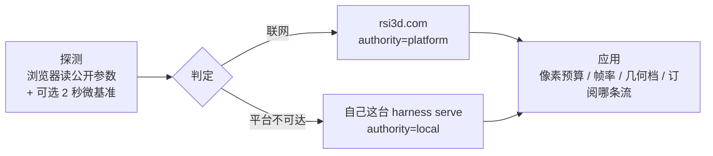

# 渲染模式：探测 → 判定 → 应用

## 1. 这一层补的是什么洞

客户端早就会**声明**自己有什么（`?agent=rsi3d-web%2F0.1.0&cap=webgl2,three`，见
[`stream.md`](./stream.md) §10），服务端据此派生一个 `render_tier`。但声明答不了两个问题：

1. **胜任吗**：声明里有 `webgl2,three` 不等于跑得动——4 核集显的老笔记本也会老实声明同一套，
   然后一开场景流就卡成幻灯片；
2. **不胜任怎么办**：降档是一件事，告诉用户**可选的出路**是另一件事。

所以加一层：**探测主机 → 判定该用哪档 → 按判定改自己的行为**。



---

## 2. 三步各自做什么、失败怎么办

| 步 | 谁做 | 产出 | 失败时 |
| --- | --- | --- | --- |
| **探测** | 浏览器（`crates/serve/src/client.js`） | `HostProfile`：`gpu{api,max_texture,software,型号哈希}` · `cpu{cores,memory_gb,platform}` · `display{viewport,dpr}` · 可选 `bench{sustained_fps,fillrate_mpx,triangles_mps}` | 探测失败 → 不做判定，按默认档跑（**不挡路**） |
| **判定** | 平台（`rsi3d.com/api/render/report`）优先；不可达时本机 `serve` 的 `POST /capability` | `RenderVerdict`：模式 + 限制 + 理由 + 缺什么 + 出路 + `authority` | 两条都不可达 → 没有限制，照常工作 |
| **应用** | 浏览器 | 见 §6 | —— |

微基准是**可选**的：固定 480×320 离屏画布，画一个高多边形物体 + 一个大平面（同时压顶点与填充率），
跑 ~1.5 秒，取**持续**帧率（不是首帧峰值）。不跑也能判，只是判得粗——那种情况下
`reasons` 里会明确写"没有微基准数据：这一档是按硬件参数判的（可能偏乐观）"。
`?bench=0` 关掉它。

### 2.1 平台有**硬预算**，兜底不许等它

平台请求的 `AbortSignal` 是 **1200ms**（`PLATFORM_BUDGET_MS`），超了就走本机判定，
并在界面上写清"平台没给答案（…），本地按同一份规则表算的"。

这条是**实测踩出来的**，不是想出来的：某个网络里平台域名既不通也**不报错**，请求就挂着，
把本机兜底一起拖住，界面上永远显示"还没判定"——看起来像功能没做完，其实是网络在挂。
三条纪律因此写死：

1. 平台只给一小段时间；判定**本来就可以离线做**，没有等它的必要。
2. 探测/调度不许串在加载后面：判定与 three.js 的加载**并行**跑（CDN 慢不该让判定迟到）。
3. 换了判定方必须**说出来**（`authority` + 一句 why），不许静默换口径。

---

## 3. 规则表是**数据**

判定规则不在代码里，在一份 JSON 里（`crates/stream/policy/render-policy.json`）：

| 档 | 要什么 | 给什么（上限） |
| --- | --- | --- |
| `client-full` | WebGL2 · ≥4 核 · 持续 ≥40 fps · 最大纹理 ≥4096 · 硬件加速 | ≤2560×1600 · ≤60 fps · 几何 real · 流 both |
| `client-lite` | WebGL2/1 · ≥2 核 · 持续 ≥20 fps · 硬件加速 | ≤1600×1000 · ≤30 fps · 几何 real · 流 both |
| `client-minimal` | WebGL2/1 · 持续 ≥8 fps（软件光栅也认） | ≤960×600 · ≤10 fps · 几何 **aabb-proxy** · 流 both |
| `frame-only` | 无（兜底档） | ≤1280×800 · ≤2 fps · 几何 aabb-proxy · 流 **frame** |
| `headless` | 形态 = 无屏 | 流 **none**（不订阅，直接落盘） |

三条纪律：

- **规则表是数据**：判定松紧随实机反馈调整，客户端不必重新发版。改表 = 改所有部署的判定，
  所以 `version` 要跟着动（判定结果里带着它，能对账）。
- **limits 只缩不放**：`max_px` / `max_fps` 都是**上限**。客户端可以要更低，要不到更高——
  服务端 `?px=` 等比缩到框内、`&fps=` 取 `min(要的, 服务端配置)`（见
  `clamp_fps()` 与它的单测）。这与 §11/§12 那条"limits 只缩不放"是同一条。
- **"不知道"不等于"不行"**：数值缺省（`0` / `null`）一律**跳过**那条规则，并在 `reasons` 里
  记一句"XX 未知：跳过这一条"。**唯一例外**是渲染所需的 GPU 接口完全未知——渲染能力不能靠猜，
  那种情况下按最保守处理（`missing` 里会写"GPU 接口未知（渲染能力不能靠猜）"）。

### 3.1 规则被实测纠错过一次

第一版给 `client-full` 加了"视口 ≥1024×600"。在真浏览器里跑，判定给出的理由是：

```
差一点就能更强：需要视口至少 1024×600，本机 669×466
```

**这条规则是错的**：窗口小不是机器弱——客户端把窗口拉大就行了，视口尺寸不能决定"能不能渲真网格"。
于是把 `min_viewport` 从 `client-full` 撤掉（字段留着，别的部署可能想用），并补了一条语料用例：

> **强机但窗口很小：窗口尺寸不是机器能力，仍是满档** → `client-full`

这是这一层现在能自我纠正的原因：**理由必须是具体数字**，否则一条拍脑袋的规则能安静地跑很久。

---

## 4. 两侧判定，靠一份共享语料钉住

| 侧 | 在哪 | 判定人 | 为什么留它 |
| --- | --- | --- | --- |
| 平台 | `rsi3d-online/server/internal/render/` | `authority=platform` | 阈值改了不用等客户端发版；将来接账号档/聚合实测 |
| 本地 | `rsi3d-harness`（`crates/stream/src/render_mode.rs`） | `authority=local` | 内网、离线、平台挂了的时候照样能判 |

规则表**唯一出处是 harness 仓库**，另外两处是副本/产物：

```
crates/stream/policy/render-policy.json        ← 源（唯一出处）
   ├── contract/render-policy.json             ← 产物（`contract --out`；服务端 /contract/render-policy.json 发它）
   └── rsi3d-online/server/internal/render/policy.json  ← 平台内嵌副本
```

求值代码两边各一份（Rust / Go），所以用**共享语料**把行为钉在一起：
`crates/stream/policy/render-policy.corpus.json`（9 例：强机 / 只有 WebGL1 / 瘦客户端 /
GPU 未知 / 无屏 / 数值全未知 / 无基准 / 软件光栅 / 小窗口），**两侧各跑一遍，结论必须一致**。

| 闸 | 守什么 |
| --- | --- |
| `crates/stream/tests/render_policy_corpus.rs::every_corpus_case_gets_the_expected_mode` | Rust 侧行为 |
| `server/internal/render/render_test.go::TestCorpusAgreesWithRust` | Go 侧行为（**读同一个文件**） |
| `TestPolicyMatchesHarnessSource` | 平台内嵌副本 == harness 源（逐字节） |
| `crates/contract/tests/render_policy.rs` | `contract/render-policy.json` == 内置规则表 |
| `contract.rs::go_side_mirrors_the_same_field_names` | Go 的 json 字段名与 Rust 一一对应 |
| `contract.rs::mirrors_only_reference_known_keys`（新增三行） | 客户端读的每个键都在契约里 |

**跨语言字段名那道闸抓到过一次真问题**：客户端声明自己会读 `max_fps`，但当时没有任何地方用它——
门禁当场变红，于是把 `&fps=`（服务端只缩不放）补上，声明才变成事实。

---

## 5. 隐私边界

- **默认脱敏**：硬件型号只上报 6 字节短哈希（`?hw=plain` 才发明文）。判定规则只需要
  "软件光栅还是硬件"、"最大纹理多大"，不需要知道型号。
- **只用于这一次判定**：`POST /capability` 与平台 `/api/render/report` 都**不落库、不写日志**
  （服务端只在内存里留**最近一次**，为了 `/healthz.host` 能回答"为什么这台机器被降档"）。
- **不做设备台账**：把主机参数攒起来做统计/画像，是另一个决定，要单独谈——这一层不顺手做。
- 平台那两个接口是**公开**的（只发阈值与判定结论，不含任何用户数据、不读 cookie），
  所以 CORS 允许任意来源（客户端的 harness 跑在 `localhost:随机端口`，登记不过来）。

---

## 6. 判定落地成哪些具体行为

| 限制 | 客户端做什么 |
| --- | --- |
| `max_px` | 图像流订阅带 `&px=WxH`，并与"自己报的显示预算"取更小者；服务端等比缩到框内 |
| `max_fps` | 图像流订阅带 `&fps=N`；服务端 `clamp_fps` 只缩不放 |
| `geometry: aabb-proxy` | **不去取几何 side-car**，只画包围盒代理（真网格的三角面数是客户端成本大头） |
| `stream: frame` | 关掉场景流订阅，左侧写明"本机不渲，右侧服务端帧是权威观测"，并强调图像流面板 |
| `stream: none` | 不订阅任何流（无屏形态） |
| `allow_animation: false` | 客户端渲染循环降到 ~5 fps 重绘（交互仍即时响应） |

界面上：顶部 `模式` 显示档位（降档变红），场景面板上方给出**判定详情**——谁判的、规则表版本、
前三条理由、差什么才能更强、以及**可点的出路**。

判定**可能晚于首连**（它与 three.js 的加载并行跑，见 §2.1）。所以 `applyVerdict()` 不是"设个变量"，
而是**把已经连上的东西改过来**：像素预算收紧了就重连图像流（不然预算只显示不生效）、判定说只看图像流
就关掉场景流、判定说只画代理就把已经取回的真网格放掉。判定迟到不该只体现为几行字。

重连路径也**不许违背判定**。这一条是浏览器实测抓出来的：首连之后还有一次"three.js 到了、重新声明能力"
的重连，那次重连会**无条件**把场景流接回来，于是判定刚关掉的流又开了，而且流自己的提示还盖掉了判定
写下的说明——看起来判定生效了，实际没有。现在的做法是把"判定要求不订场景流"做成 `connectScene()`
入口的守卫（`sceneStreamWanted()`），任何来路的连接都得先过它。验证方式是看**服务端**记录：
判定为 `client-minimal` 时，`/healthz.clients` 里只剩一条 `frame` 连接。

---

## 7. 不做什么

- **不把渲染搬到 rsi3d.com**：平台**永不中转 3D 业务数据**（数据面红线）。"云端渲染"要落地，
  只能是客户自装 gateway/worker，或明确开例外——这一层不碰。
- **不读指纹类接口**（字体枚举、Canvas 指纹、Audio 指纹……）。判定需要的是性能参数，不是身份。
- **不做设备台账**（见 §5）。
- **不因为"读不到"就降档**（见 §3）。

---

## 8. 命令行

```bash
rsi3d-harness render-mode                          # 打印规则表（什么档要什么、给什么）
rsi3d-harness render-mode --profile host.json      # 判一台机器（**离线那条路**，authority=local）
rsi3d-harness render-mode --profile host.json --policy from-platform.json
rsi3d-harness serve scene.json --policy from-platform.json   # 让 /capability 用平台的规则表
```
